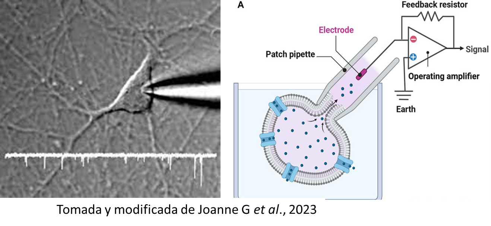
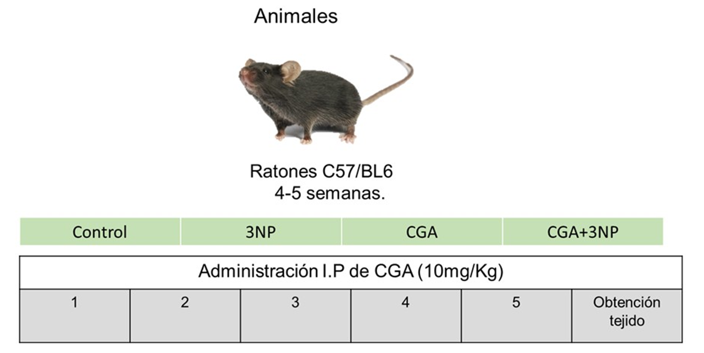

# Introduccion

"Evaluacion del efecto neuroprotector del acido clorogenico en un modelo de neurodegeneracion estriatal"

Electrofisiologia celular

Fijacion de celula completa (Whole-cell) en la modalidad patch clamp (voltage clamp)



¿La microbiota juega un papel en la neurodegeneracion?

](images/clipboard-4040367182.png)

+----------------------------------------------------------------------------------------+
| Literatura de interes                                                                  |
+========================================================================================+
| -   <https://www.nature.com/articles/s41392-024-01743-1?utm_source=chatgpt.com#citeas> |
| -   <https://www.nature.com/articles/s41392-024-01743-1?utm_source=chatgpt.com>        |
| -   <https://www.nature.com/articles/s41531-021-00213-7?fromPaywallRec=false>          |
| -   <https://www.nature.com/articles/s41398-025-03504-2?fromPaywallRec=false>          |
+----------------------------------------------------------------------------------------+

### Materiales y metodos



# Mapa poblacion en CDMX con Huntington

## Libreria utilizada

```{r, message=FALSE}
library(sf)
library(terra)
library(tidyverse) 
library(ggspatial) 
library(scales)    
library(ggnewscale)
library(file2meco)
library(microeco)
library(ggplot2)
library(magrittr)
library(dplyr)
library(GUniFrac)
library(tidyr)
library(phyloseq)
library(patchwork)
library(ggpubr)

```

## Parámetros estimados

A nivel nacional: Se estima que alrededor de 8,000 personas padecen la enfermedad de Huntington en México. En la Ciudad de México (estimado): No hay una cifra específica disponible para la Ciudad de México. A partir de la prevalencia nacional (1 caso por cada 10,000 habitantes) reportada en 2025 por la asociación Huntington México, y la población de la Ciudad de México (9.2 millones), se podría estimar que hay alrededor de 920 personas con esta enfermedad en la ciudad.

```{r, echo=FALSE, eval=FALSE, message=FALSE}

#Alzheimer ====
#A nivel nacional: Un millón 300 mil personas padecen la enfermedad de Alzheimer en México, lo que representa entre el 60% y el 70% de los diagnósticos de demencia en adultos mayores de 65 años. En la Ciudad de México (estimado): Un reporte de la Fundación para Ancianos Concepción Béistegui, aunque de 2019, indicó que había 104,674 personas con algún tipo de demencia en la Ciudad de México. 
#====

#Parkison====
#A nivel nacional: La estimación de personas con Parkinson en México varía considerablemente según la fuente, con cifras recientes que van desde 125,000 hasta más de 500,000 casos. En la Ciudad de México: Al no haber cifras específicas para la ciudad, una estimación basada en la población de la Ciudad de México (aproximadamente 9.2 millones) y la tasa nacional de 50 casos nuevos por cada 100,000 habitantes anualmente, podría proporcionar una aproximación del riesgo. 
#====

#Huntington====
#A nivel nacional: Se estima que alrededor de 8,000 personas padecen la enfermedad de Huntington en México. En la Ciudad de México (estimado): No hay una cifra específica disponible para la Ciudad de México. A partir de la prevalencia nacional (1 caso por cada 10,000 habitantes) reportada en 2025 por la asociación Huntington México, y la población de la Ciudad de México (9.2 millones), se podría estimar que hay alrededor de 920 personas con esta enfermedad en la ciudad.
#====
```

```{r, message=FALSE}
t_alzheimer_cdmx <- 104674
t_huntington_cdmx <- 920

poblacion_cdmx <- 9.2e6
poblacion_mexico <- 126e6
t_parkinson_cdmx <- round(125000 * (poblacion_cdmx / poblacion_mexico))

```

## Cargar polígonos de alcaldías y raster de población

```{r, message=FALSE}
#Capa vectorial 

alcaldias_shp <- "poligonos_alcaldias_cdmx.shp" 

alcaldias <- st_read(alcaldias_shp) %>%
  st_transform(crs = 4326) # Reproyectar a WGS84 

#Capa raster
raster_poblacion_mx <- "poblacion_mexico_2020.tif"

pop_rast_full <- rast(raster_poblacion_mx)


#extensión de las alcaldías
pop_rast_cdmx <- terra::crop(pop_rast_full, vect(alcaldias))

pop_rast_cdmx <- terra::mask(pop_rast_cdmx, vect(alcaldias))

```

## Calcular población total por alcaldía

```{r, message=FALSE}
#Calcular población total por alcaldía usando terra::extract
pop_extract <- terra::extract(pop_rast_cdmx, 
                              vect(alcaldias), 
                              fun = sum, 
                              na.rm = TRUE)

# Asignar población extraída al objeto 'alcaldias'

alcaldias$pop_tot <- pop_extract[, 2] 

# Estimar casos por alcaldía, donde "prop_pop" es la proporción de la población de la alcaldía vs. el total de poblacion de la CDMX

alcaldias <- alcaldias %>%
  mutate(prop_pop = pop_tot / sum(pop_tot, na.rm = TRUE),
    alzheimer_casos = round(prop_pop * t_alzheimer_cdmx),
    parkinson_casos = round(prop_pop * t_parkinson_cdmx),
    huntington_casos = round(prop_pop * t_huntington_cdmx))

```

## Prepararamos los datos para ggplot

```{r, message=FALSE}
# primero convertimos el RASTER de población a un dataframe
pop_df <- as.data.frame(pop_rast_cdmx, 
                        xy = TRUE, 
                        na.rm = TRUE)

#Renombraramos la columna de "población" 

names(pop_df)[3] <- "poblacion" 

# Limpiar valores de población

pop_df <- pop_df %>% filter(poblacion >= 0)

```

## Graficamos

```{r, message=FALSE}
mapa_huntington <- ggplot(data = alcaldias) +
  geom_sf(aes(fill = huntington_casos), 
          color = "white", 
          lwd = 0.3) +
  scale_fill_viridis_c(
    option = "plasma",
    labels = comma,
    name = "Casos Huntington \n(Estimado)") +
  labs( title = "Estimación de Casos de Huntington por Alcaldía, CDMX (2025)",
    subtitle = paste0("Total CDMX (estimado): ", 
                      format(t_huntington_cdmx, big.mark=",")),
    caption = "Elaboración propia. Fuente: Estimaciones de prevalencia y datos de WorldPop.") +
  annotation_scale(location = "bl", 
                   width_hint = 0.4, 
                   style = "ticks") +
  annotation_north_arrow(location = "tr", 
                         style = north_arrow_fancy_orienteering)+
  theme_minimal() +
  theme(plot.title = element_text(face = "bold", 
                                  size = 16),
        axis.title = element_blank())

print(mapa_huntington)

ggsave("mapa_huntington_cdmx.png",
       path = "Figuras",
       plot = mapa_huntington,
       width = 8, 
       height = 8, 
       dpi = 300, 
       bg = "white")
```

### Creamos zoom de mapa

```{r, message=FALSE, warning=FALSE}
#Identificar la alcaldía con más casos para el zoom(por probabilidad de dencidad es de poblacion con los datos que proporcionamos, teoricamente la fila 1 seria la de mayor casos teoricos de huntington)

alcaldia_max_casos <- alcaldias %>%
  arrange(desc(huntington_casos)) %>%
  slice(1) 

# Necesitamos el nombre de la columna que tiene el nombre de la alcaldía use 'NOMGEO'. 

alcaldia_zoom_nombre <- alcaldia_max_casos$NOMGEO

#graficamos 

mapa_zoom <- ggplot() +
   geom_raster(data = pop_df, 
               aes(x = x, 
                   y = y, 
                   fill = poblacion)) +
  scale_fill_viridis_c(option = "cividis", 
                       trans = "log10", 
                       guide = "none") +
  geom_sf(data = alcaldia_max_casos, 
          aes(fill = huntington_casos), 
          color = "red", 
          lwd = 1) +
  scale_fill_viridis_c(
    option = "plasma", 
    trans = "sqrt",
    name = "Casos Estimados") +
# Aplicar el zoom usando las coordenadas de la alcaldía seleccionada
  coord_sf(
    xlim = st_bbox(alcaldia_max_casos)[c(1, 3)],
    ylim = st_bbox(alcaldia_max_casos)[c(2, 4)],
    expand = FALSE) +
  labs(
    title = paste(alcaldia_zoom_nombre),
    subtitle = paste("Población:", format(alcaldia_max_casos$pop_tot, big.mark=","),
                     "\nCasos (Huntington.):", format(alcaldia_max_casos$huntington_casos, big.mark=","))) +
  theme_void() +
  theme(
    plot.title = element_text( face = "bold",
                               size = 12,
                               hjust = 0.5),
    legend.position = "none", 
    panel.border = element_rect(color = "black", 
                                fill = NA, 
                                linewidth = 1))

print(mapa_zoom)
```

## Mapa final

```{r, message=FALSE, warning=FALSE}

mapa_final <- mapa_huntington + mapa_zoom +
  plot_layout(widths = c(3, 1))

print(mapa_final)

ggsave("Mapa_huntington_CDMX.png", 
       path = "Figuras",
       plot = mapa_final, 
       width = 10, 
       height = 7, 
       units = "in", 
       bg="white",
       dpi = 320) 
```

# Carga base de datos

```{r, message=FALSE}
abund_file.path <- ("DATA/QZA/table-dada2.qza")
muestra.path <- ("DATA/sample-metadata_V2.txt") 
a_taxonomia.path <- ("DATA/QZA/taxonomy.qza") 
Arbol_filogenetico.path <- ("DATA/QZA/rooted-tree.qza")
seq_datos.path <- ("DATA/QZA/seqs-dada2.qza")


#aqui lo que estoy haciendo es tranformar los datos de microbiota obtenidos, a datos legibles en tidyverse, mediante la paqueteria "microeco". 

Datos_mb <- qiime2meco(
  feature_table =  "DATA/QZA/table-dada2.qza",
  taxonomy_table = "DATA/QZA/taxonomy.qza",
  sample_table = "DATA/sample-metadata_V2.txt",
  phylo_tree = "DATA/QZA/rooted-tree.qza",
  rep_fasta = "DATA/QZA/seqs-dada2.qza",
  auto_tidy = TRUE)

#ahora sembramos una semilla para que los datos sean reproducibles
set.seed(123)

```

## Seleccion de datos

```{r, message=FALSE}
#que datos usar====
#En mi base de datos tengo grupos que no me pertenecen y no puedo usar pero dado que el objeto Datos_mb es una microtabla no puedo usar la funcion summary, por lo que para saber cuantas filas tiene y donde se encuentran mis datos primedo debo usar la funcion "Datos_mb[["sample_table"]][["Grupo"]]; #yo se que mis datos son los ultimos 20 por lo que para visualizarlos uso. 
#====

Datos_mb[["sample_table"]][["Grupo"]]

tail(Datos_mb$sample_table,20)

#Inspeccion incial para determinar la estructura de los datos de abundancia microbiana ====
#aqui lo que estamos haciendo es una inspección inicial de las primeras 8 muestras para ver cómo están estructurados los datos de abundancia microbiana. Ya que en la tabla de abundancia de OTU (o ASV) las filas suelen ser las muestras y las columnas son los identificadores taxonómicos (OTU/ASV).
#====

head(Datos_mb$otu_table, 8)


# Verificando que los identificadores microbianos====
#ahora lo que estamos haciendo es verificando que los identificadores microbianos (OTU/ASV) tengan asignadas correctamente sus clasificaciones taxonómicas, ya que, tax tale es una matriz que contiene la información de clasificación biológica para cada OTU (o ASV) de un conjunto de datos. Las filas corresponden a los OTU/ASV y las columnas contienen sus clasificaciones (Reino, Filo, Clase, Orden, Familia, Género, Especie).
#====

head(Datos_mb$tax_table, 8)

#una vez determinados los datos a usar y verificamos si sample_table, otu_tabe y tax table son data_frame 

class(Datos_mb$otu_table)
class(Datos_mb$sample_table)
class(Datos_mb$tax_table)


```

### Filtrar grupos

```{r, message=FALSE}
#Aqui debemos filtrar grupos especificos====
#dado que la base de datos contiene datos que no quiero usar, debemos filtrar los grupos experimentales que nos interesan los cuales son "Control2, 3NP2, CGA,3NP_ CGA"
#====
Datos_mb[["sample_table"]][["Grupo"]]

#primero generamos una copia de seguridad 

Datos_mb2 <- unserialize(serialize(Datos_mb, NULL))

grupos_mantener <- c("Control2", "3NP2", "CGA", "3NP_CGA")

# Filtrar la tabla de muestras de mb2
Datos_mb2$sample_table <- Datos_mb2$sample_table %>%
  filter(Grupo %in% grupos_mantener)


Datos_mb2[["sample_table"]][["Grupo"]]

#para hacer que siempre respete el orden de las columnas 

orden_datos <- c("Control2", "3NP2", "CGA", "3NP_CGA")

#aqui cambiamos el nombre de las columnas 
n_nombres <- c("Control", "3NP", "CGA", "3NP_CGA")

Datos_mb2$sample_table$Grupo <- factor(Datos_mb2$sample_table$Grupo,levels = orden_datos,
                                       labels = n_nombres)

#verificamos el cambio de nombre 
Datos_mb2[["sample_table"]][["Grupo"]]


```

## Dar formato tidy a la base de datos

```{r, message=FALSE, results='hide'}
#Ordenar los datos dentro de Datos_mb2====
#Ahora lo que debemos hacer es estandarizar y formatear los datos taxonómicos dentro del objeto Datos_mb, para que sean fáciles de usar y analizar. Para lo cual utilizaremos la funcion :tidy_taxonomy, ya que esta funcion lo que hace es  "ordenar"  los datos taxonómicos, evitando redundancias y poniendolos todos en un formato legible e identico para todos los datos. Ademas estos datos se anexaran a un nuevo objeto, pero guardando una copia de los datos originales.
#====

Datos_mb2$tax_table %>% tidy_taxonomy()

mb <- Datos_mb2

mb_copia <- mb

class(mb)

```

## Filtrar taxa Archea y Bacteria

```{r, message=FALSE}
#Ahora filtraremos los taxa que nos interesan, en mi caso especifico es Archea y Bacteria. 

mb$tax_table <- mb$tax_table %>%
  filter(Kingdom == "k__Archaea" | Kingdom == "k__Bacteria")

# Ahora dentro de mi base de datos se encuentran OTUs con asignación taxonómica de “mitochondria”y/o “chloroplast”, por lo que debemos eliminar las líneas que contienen la palabra del taxón independientemente de los rangos taxonómicos e ignorar las mayúsculas y minúsculas en la "tax_table"
#=====

mb$filter_pollution(taxa = c("mitochondria", "chloroplast"))

#aqui para poder filtrar dos taxones necesito agruparlos en un vector para lo cual estoy utilizando la funcion C(), la cual agurpa datos en vectores, una vez aplicados hay que organizar de nuevo los datos en un formato tidy 

mb$tidy_dataset()

mb

# Con la función sample_sums() checamos el número de secuencias en cada muestra, en nuestro caso usaremos 20,000 para casa muestra 
mb$sample_sums() %>% range()

mb$rarefy_samples(sample.size = 20000)

#revisamos si modifico el numero de secuencia por muestra 
mb$sample_sums() %>% range
```

# Analisis preliminares

```{r, message=FALSE, warning=FALSE}
#calcular diversidad alpha, calculando el indice de diversidad filogenetica de Faith 

mb$cal_alphadiv(PD= FALSE)

class(mb$alpha_diversity)

#Guardar datos de diversidad alpha====    
#ahora guardademos por separado la base de datos de diversidad alfa 

mb$save_alphadiv(dirpath = "Salidas")

#Calcular la diversidad beta====
#aqui utilizaremos la funcion "UniFrac" la cual es una métrica de diversidad beta que incluye información filogenética. de modo que no solo se comparan las especies que se encuentran presentes, sino también qué tan relacionadas están entre sí
#====

mb$cal_betadiv(unifrac = TRUE)

class(mb$beta_diversity)

#guardar resultados de divercidad beta 
mb$save_betadiv(dirpath = "Salidas")

mb

# Genero una copia de seguridad 

mb_v2 <- unserialize(serialize(mb, NULL))

# Establecemos la abundancia relativa mayor a 0.001 (0.1%)

mb_v2$filter_taxa(rel_abund = 0.0001, freq = 0.1)

#en mi caso me interesan los 10 generos y familias mas abundantes, ya que es lo que usualmente se reporta en los articulos de microbiota, por lo que ahora debemos filtrar las 10 familias mas abundantes en nuestra base de datos 

f1 <- trans_abund$new (dataset= mb_v2, 
                       taxrank = "Family", 
                       ntaxa = 10)


f1$plot_bar(others_color = "grey50",
            facet = "Grupo",
            xtext_keep = FALSE, 
            legend_text_italic = TRUE,
            bar_full = TRUE,
            barwidth = 0.8)

```

# Familia y Genero mas abundantes

```{r, message= FALSE, warning=FALSE}
#calcular promedios de grupos para familia 
t1_prom_family <- trans_abund$new(dataset = mb_v2,
                           taxrank = "Family",
                           ntaxa = 10,
                           groupmean = "Grupo",
                           group_morestats = TRUE)

#Graficamos 
g1 <- t1_prom_family$plot_bar(others_color = "grey70")

g1 <- g1 + 
  theme_classic() + 
  theme(
    axis.title.y = element_text(size = 20),    
    axis.text.x = element_text(size = 16),     
    axis.title.x = element_text(size = 16),
    legend.text = element_text(size = 15, face = "italic"),
    legend.title = element_text(size = 17),
    legend.position = "right")

print(g1)


ggsave("Barras_familia.png", 
       path = "Figuras",
       plot = g1, 
       width = 9, #ancho de la figura
       height = 7, #alto de la figura
       units = "in", #unidad del tamaño figura "pulgadas"
       bg="white",
       dpi = 320) #calidad de la figura 

#calcular promedios de grupos para genero

t1_prom_genero <- trans_abund$new(dataset = mb_v2,
                                  taxrank = "Genus",
                                  ntaxa = 10,
                                  groupmean = "Grupo",
                                  group_morestats = TRUE)

#Graficamos 

g2 <- t1_prom_genero$plot_bar(others_color = "grey70")

g2 <- g2 + 
  theme_classic() + 
  theme(
    axis.title.y = element_text(size = 20),    
    axis.text.x = element_text(size = 13),     
    axis.title.x = element_text(size = 16),
    legend.text = element_text(size = 15, 
                               face = "italic"),
    legend.title = element_text(size = 17),
    legend.position = "right")

print(g2)

ggsave("Barras_Genero.png", 
       path = "Figuras",
       plot = g2, 
       width = 9, 
       height = 7, 
       units = "in", 
       bg="white",
       dpi = 320) 


#hacemos un mapa de calor para familia ====

g3 <- t1_prom_family$plot_heatmap(xtext_keep = FALSE, 
                                    withmargin = FALSE, 
                                    plot_breaks = c(0.01, 
                                                    0.1,
                                                    1, 
                                                    10))+
  theme(axis.text.y = element_text( face = "italic",
                                    size = 13))+
  theme(axis.text.x = element_text(angle = 90,
                                   hjust = 1,
                                   vjust = 0.5, 
                                   size = 12.5
                                   ))
print(g3)

ggsave("Mapa_calor_Familia.png", 
       path = "Figuras",
       plot = g3, 
       width = 9, 
       height = 7, 
       units = "in", 
       bg="white",
       dpi = 320) 


#mapa de calor para genero====

g4 <- t1_prom_genero$plot_heatmap(xtext_keep = FALSE, 
                                  withmargin = FALSE, 
                                  plot_breaks = c(0.01, 
                                                  0.1, 
                                                  1, 
                                                  10))+
  theme(axis.text.y = element_text(face = "italic",
                                   size = 13)) +
  theme(axis.text.x = element_text(angle = 90,
                                   hjust = 1,
                                   vjust = 0.5, 
                                   size = 12.5))

print(g4)

ggsave("Mapa_calor_Genero.png", 
       path = "Figuras",
       plot = g4, 
       width = 9, 
       height = 7, 
       units = "in", 
       bg="white",
       dpi = 320) 

#====


```

# Diversidad alfa

```{r, message=FALSE}

#ahora vamos a crear un objeto para calcular la diversidad alpha

#utilizamos la funcion trans$alpha$new tomamos la base de datos que hemos usado mb_v2, y especificamos que lo haga solo por grupo 

t1_div_alpha <- trans_alpha$new(dataset = mb_v2,
                             group = "Grupo")

#revisamos si existe la tabla estadictica que contenga los valores de diversidad alfa calculados para cada muestra, junto con estadísticas descriptivas (como la media, mediana, desviación estándar) para cada nivel de la variable  "Grupo".

t1_div_alpha$data_stat


#ejecutamos una la prueba estadistica de wilcoxon para determinar si existen diferencias significativas 

t1_div_alpha$cal_diff(method = "wilcox")

print(t1_div_alpha$res_diff, max = 99999)

#graficamos diversidad alpha con indice Shannon 

g_div_alfa_1 <- t1_div_alpha$plot_alpha(measure = "Shannon",
                        add = "dotplot",
                        xtext_size = 15) + 
  ggtitle("Diversidad Alfa por grupos")+
  theme(plot.title = element_text(size = 18, 
                                  hjust = 0.5,
                                  face = "bold"))

print(g_div_alfa_1)

#graficamos diversidad alpha con indice Simpson

g_div_alfa_2 <- t1_div_alpha$plot_alpha(measure = "Simpson",
                        add = "dotplot",
                        xtext_size = 15) + 
  ggtitle("Diversidad Alfa por grupos")+
  theme(plot.title = element_text(size = 18, 
                                  hjust = 0.5,
                                  face = "bold"))
print(g_div_alfa_2)

#Generamos una grafica compuesta 

g_div_alfa_t <- g_div_alfa_1 + g_div_alfa_2

print(g_div_alfa_t)

ggsave("Diversidad alpha.png", 
       path = "Figuras",
       plot = g_div_alfa_t, 
       width = 9, 
       height = 7, 
       units = "in", 
       bg="white",
       dpi = 320)


```

# Diversidad beta

```{r}
#calculamos divercidad beta====
# "bray" se refiere a la disimilitud de Bray-Curtis

t1_div_beta<- trans_beta$new(dataset = mb_v2, 
                      group = "Grupo", 
                      measure = "bray")
#ahora dado que tenemos una matriz con muchas dimenciones en la diversidad beta, utilizaremos la funcion "PCoA"(Principal Coordinates Analysis o Análisis de Coordenadas Principales) para ordenar la matriz y poder visualizarla de modo 2D, ademas este metodo es el metodo estandar para usar con matrices resultantes del indice Bray-Curtis.

t1_div_beta$cal_ordination(method = "PCoA")

class(t1_div_beta$res_ordination)

#graficamos 

PCoA_1 <- t1_div_beta$plot_ordination(plot_color = "Grupo",
                                      point_size = 5,
                                      plot_type = c("point", "ellipse"),
                                      ellipse_chull_fill = FALSE,
                                      ellipse_chull_alpha = 0.1) +
  theme_classic() +
  theme(axis.title.y = element_text(size = 18),    
        axis.text.x = element_text(size = 12),     
        axis.title.x = element_text(size = 12),
        legend.text = element_text(size = 14),
        legend.title = element_text(size = 16),
        legend.position = "right")  

print(PCoA_1)


#box plot para diversidad beta por grupos 

t1_div_beta$cal_group_distance(within_group = TRUE)

t1_div_beta$cal_group_distance_diff(method = "wilcox")

g1_div_beta <- t1_div_beta$plot_group_distance(add = "mean") +
  theme_classic() +
  theme(
    axis.title.y = element_text(size = 18),    
    axis.text.x = element_text(size = 12),     
    axis.title.x = element_text(size = 12),
    legend.text = element_text(size = 14),
    legend.title = element_text(size = 16),
    legend.position = "right")


print(g1_div_beta)


#anova diversidad beta
t1_div_beta$cal_manova(manova_all = TRUE)
t1_div_beta$res_manova
resultado_global_div_B <- t1_div_beta$res_manova

print(resultado_global_div_B)

t1_div_beta$cal_manova(manova_all = FALSE)
t1_div_beta$res_manova
resultado_porgrupo_div_B <- t1_div_beta$res_manova

print(resultado_porgrupo_div_B)
```

# Taxa significativos en los grupos experimentales evaluados

```{r, message=FALSE, warning=FALSE}
t2_grupo<- trans_diff$new(dataset = mb_copia, 
                     method = "lefse", 
                     group = "Grupo", 
                     taxa_level = "Genus", 
                     alpha = 0.05, 
                     lefse_subgroup = NULL, 
                     p_adjust_method = "none")

#Graficamos 
g5 <- t2_grupo$plot_diff_bar(use_number = 1:10, width = 0.6)+
  xlab("Genero")+
  theme(plot.title = element_text(hjust = 0.5, 
                                  size = 20, 
                                  face = "bold"))

print(g5)


#taxas significatvos de familias por grupos 

t2_familia <- trans_diff$new(dataset = mb_copia, 
                     method = "lefse", 
                     group = "Grupo", 
                     taxa_level = "Family", 
                     alpha = 0.05, 
                     lefse_subgroup = NULL, 
                     p_adjust_method = "none")
  

g6 <- t2_familia$plot_diff_bar(use_number = 1:10, width = 0.6)+
  xlab("Familia")+
  theme(plot.title = element_text(hjust = 0.5, 
                                  size = 20, 
                                  face = "bold"))
 
print(g6)

#Generamos una grafica compuesta 

g7_sig <- g6+g5

print(g7_sig)

ggsave("comparacion abundancia.png",
       path = "Figuras",
       plot = g7_sig,
       width = 15, 
       height = 7, 
       units = "in", 
       bg="white",
       dpi = 320)

```

# Concluciones

Con los datos obtenidos se puede inferir que no existe una correlación entre la alteración de la microbiota intestinal de ratones **C57BL/6** y los diferentes grupos experimentales evaluados (Control, 3NP, CGA, CGA_3NP).

Sin embargo, se requiere un análisis estadístico más profundo, así como el incremento en el número de repeticiones por grupo, para poder concluir de manera certera si existen o no diferencias significativas entre los grupos.
